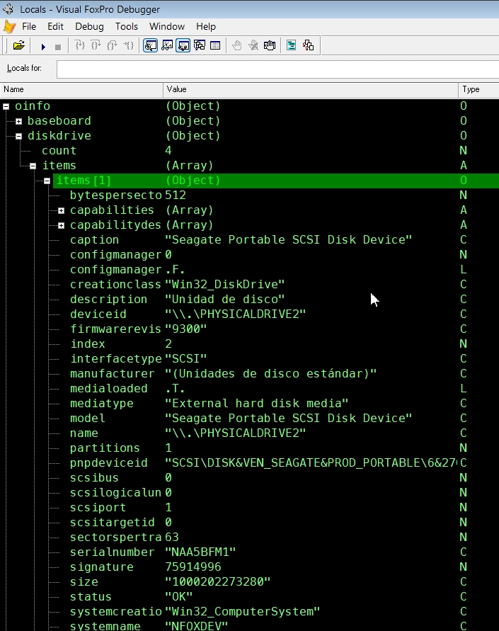

# _wmi
gets any wmi query as object;

usage: _wmi( wmiClass [where <filter condition>] [, wmiNameSpace] )
 
 * where: optional query filter 
 * wmiNameSpace defaults to "CIMV2"

sample calls:

 * oDisks = _wmi('Win32_diskDrive') 
 * oMonitors = _wmi('Win32_PNPEntity where service = "monitor"')

ships with embedded test function, just do "testme in _wmi" and check "oInfo" in your debugger:

 
